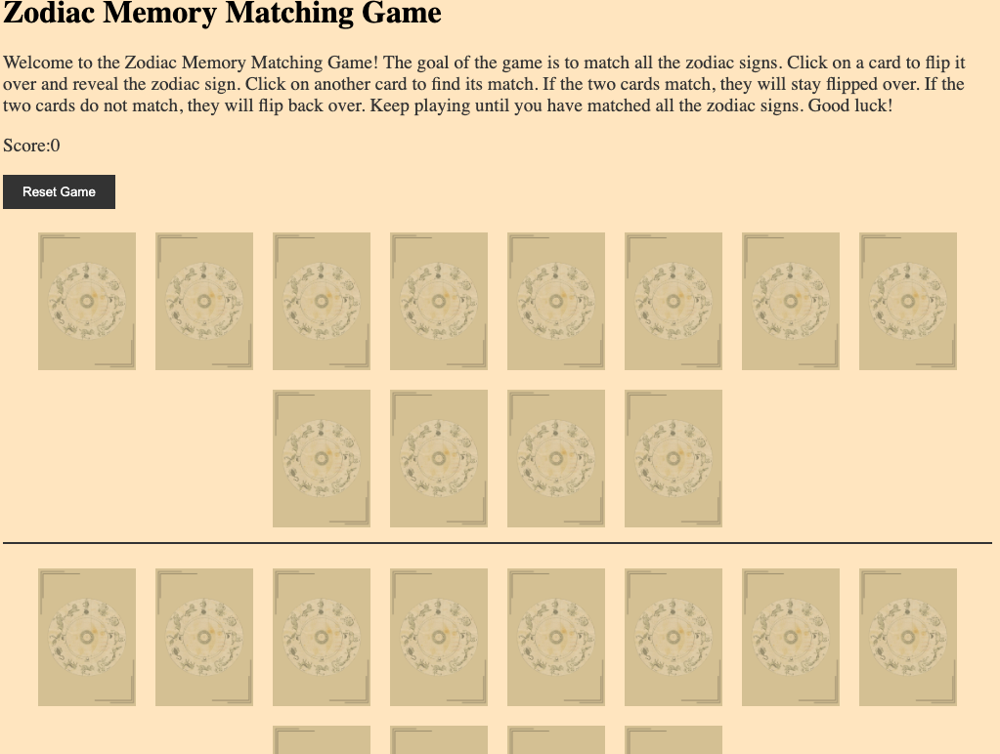
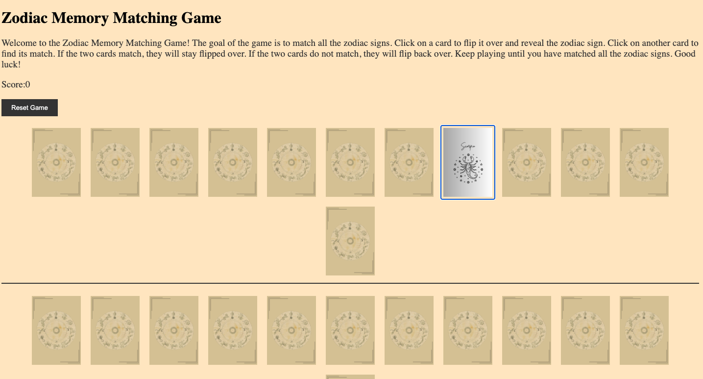
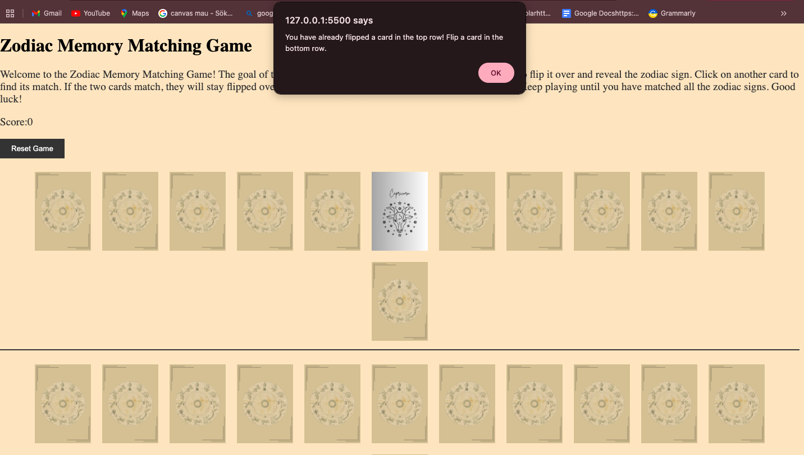
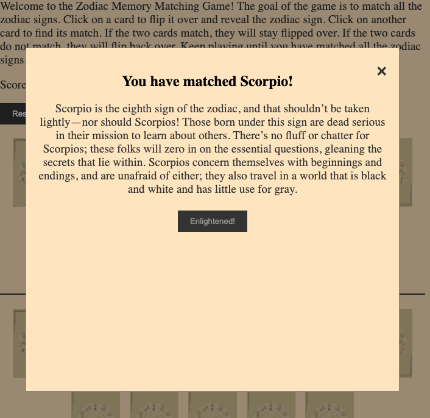
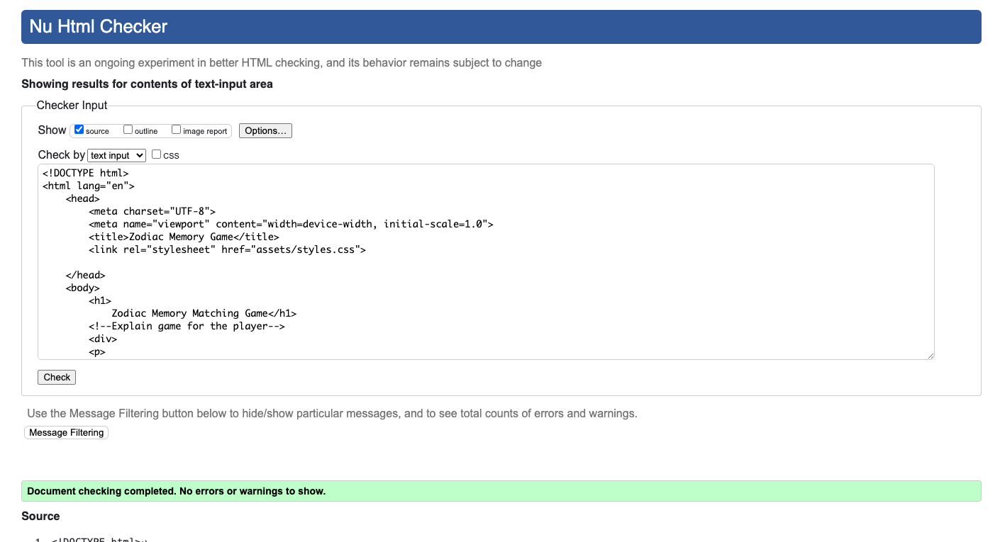
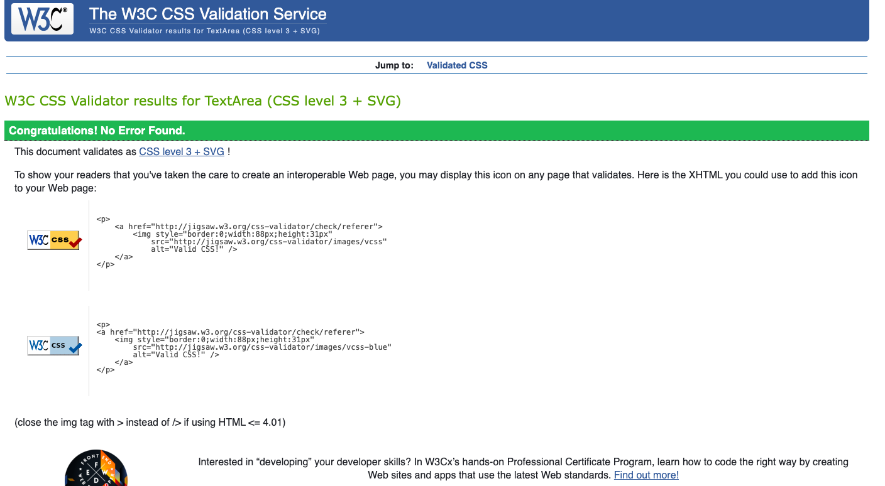
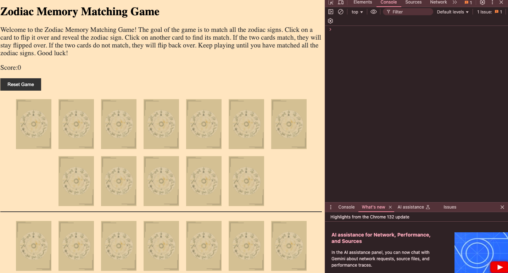
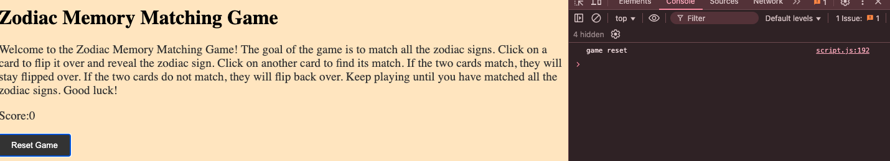

# Zodiac Memory Matching Game

## Table of Contents
- [Introduction](#introduction)
- [How to Play](#how-to-play)
- [Features](#features)
- [Technologies Used](#technologies-used)
- [Gameplay Screenshots](#gameplay-screenshots)
- [Testing](#testing)
- [Known Issues](#known-issues)
- [Future Enhancements](#future-enhancements)
- [Deployment](#deployment)
- [Credits and Contact](#credits-and-contact)


## Introduction
The **Zodiac Memory Matching Game** is a fun and interactive game where players match zodiac-themed cards. The game challenges your memory by having you flip one card from the top row and one from the bottom row, aiming to find pairs that match. 

## How to Play
1. Flip one card from the **top row** by clicking on it. 
2. Flip one cards from the **bottom row** to try to match it with the first card from the **top row**
3. If the two cards don't match: 
 - The cards flip back after a short delay. 
 - Player has to try again
4. If the two cards match: 
 - Player scores a point. 
 - The cards remain flipped. 
5. The game continues until all pairs are matched.   

--- 
## User Stories

- As a player, I want to flip a card and reveal a zodiac symbol so I can try to find its match.
- As a player, I want to match a card from the top row with one from the bottom to score a point.
- As a player, I want visual feedback and popups when I find a match so I feel rewarded.
- As a player, I want to reset the game and try again when I want.
- As a player, I want the game to work on my mobile device, tablet, and computer.

---
| **User Story** | **Tested Feature** | **Expected Result** | **Actual Result** | **Pass/Fail** |
|----------------|--------------------|----------------------|-------------------|----------------|
| Flip a card and see the zodiac | Button Click | Clicking a card flips it to show zodiac | Works as expected | ✅ Pass |
| Match top row to bottom row | Matching logic | Only cards from different rows can match | Works as expected | ✅ Pass |
| Get feedback after match | Modal Popup | A modal appears with sign info | Modal works, minor mobile overflow | ⚠️ Pass with known issue |

---
## Features

**Zodiac-Themed cards designed by moi**: gives you a good opportunity to learn about astrology and yourself

**Memory Challenge:** Test your ability to recall card placement.

**Responsive Design:** works on difeerent devices like mobile phone, desktop and tablets. 

**Score Tracking:** Keeps track of how many matches you've made.


---
## Technologies Used

**HTML:** Structuring the game layout. 

**CSS:** Styling the game interface.

**JavaScript:** Implement game logic, card flipping, interactivity and match functionality. 

---
## Gameplay Screenshots
| Screenshot | Description |
|------------|------------|
|  | The main interface of the Zodiac Memory Game, where players match cards based on zodiac signs. |
|  | A flipped card revealing its zodiac sign after the player clicks on it. |
|  | An alert appears if the player selects two cards from the same row, enforcing the game rules. |
|  | A pop-up notification appears when two matching cards are found, updating the score. |


## Testing 

Below you have a table with all the testing I have done on my game.

| **Test Type**  | **Tested Feature**             | **Expected Result**                         | **Actual Result** | **Pass/Fail** | **Screenshot** |
|---------------|--------------------------------|---------------------------------------------|------------------|-------------|--------------|
| **HTML**      | Validate HTML with W3C        | No errors                                  | No errors        | ✅ Pass     |  |
| **CSS**       | Validate CSS with W3C         | No errors                                  | No errors        | ✅ Pass     |  |
| **JavaScript**| Console Errors                | No console errors in DevTools              | No errors found  | ✅ Pass     |  |
| **JavaScript**| Button Clicks                 | Buttons trigger correct functions          | Buttons work fine | ✅ Pass  |  |


## Known Issues
- No issues are noted at this point.


## Possible Future Enhacements
- Add a timer to make it more challenging 
- Reshuffle cards to make the game more difficult.  
- Add more animation for flipping cards for a smoother experience. 
- Have the cards come forward to make them readable for the player. 

## Credits 
- Zodiac images and cards designed by me on [canva] (https://www.canva.com/).
- Game concept is inspired by the classic memory card game that all of us have played at least once in our life time. 

---
# Deployment

## Local Deployment

### Local Preparation

**Requirements:**
- An IDE of your choice, such as [Visual Studio Code](https://code.visualstudio.com/) or [Atom](https://atom.io/)
- [Git](https://git-scm.com/)
- A web browser for testing the project
- Basic knowledge of HTML, CSS, and JavaScript

### Local Instructions

1. Download the project repository [here](https://github.com/NavyBlue06/project2Zodiacgame/archive/main.zip) and extract the zip file to your desired location. Alternatively, clone the repository using:
   ```
   git clone https://github.com/NavyBlue06/project2Zodiacgame.git
   ```
2. Launch your IDE and open the base directory of the extracted or cloned repository.
3. To view the project locally, open the `index.html` file in a web browser. Alternatively, if Python is installed, you can serve the project locally by running:
   ```
   python3 -m http.server
   ```
   Then, visit `http://localhost:8000` in your browser.
4. Modify the files as needed to customize or enhance the project.

---

## GitHub Deployment

### GitHub Preparation

**Requirements:**
- A free GitHub account

### GitHub Instructions

1. Sign in to your GitHub account and go to your repository: [https://github.com/NavyBlue06/project2Zodiacgame](https://github.com/NavyBlue06/).
2. Ensure all updates are committed and pushed to the main branch.
3. Open the **Settings** page of the repository.
4. Scroll down to the **Pages** section under "Code and automation."
5. Under "Source," choose the branch to deploy (e.g., `main`) and select the `/root` folder.
6. Click **Save** and allow a few moments for GitHub Pages to publish the site.
7. Once completed, the site will be accessible at: `https://navyblue06.github.io/project2Zodiacgame/`.

---
## Credits and Contact

### Content
Nearly all text content for this project was generated or refined using OpenAI's ChatGPT-4. The AI tool was also instrumental in correcting and generating high-quality textual content to ensure clarity and professionalism.
All media used is my own.

**Contact Me:**
- 📧 Email: [navaheierdal92@outlook.com](mailto:navaheierdal92@outlook.com)
- 🐙 GitHub: [NavyBlue06](https://github.com/NavyBlue06)


## Installation 
1. Clone or download the repo to your local machine: 
```bash 
 git clone https://github.com/NavyBlue06/project2game.git ```


