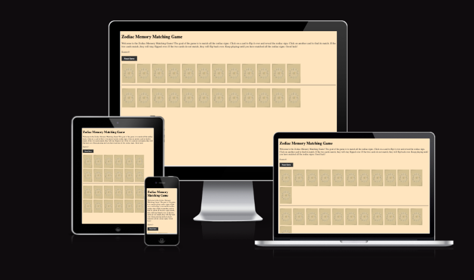

# Zodiac Memory Matching Game

## Introduction
The **Zodiac Memory Matching Game** is a fun and interactive game where players match zodiac-themed cards. The game challenges your memory by having you flip one card from the top row and one from the bottom row, aiming to find pairs that match. 

## How to Play
1. Flip one card from the **top row** by clicking on it. 
2. Flip one cards from the **bottom row** to try to match it with the first card from the **top row**
3. If the two cards don't match: 
 - The cards flip back after a short delay. 
 - Player has to tr again
4. If the two cards match: 
 - Player scores a point. 
 - The cards remain flipped. 
5. The game continues until all pairs are matched.   

--- 
## Features

**Zodiac-Themed cards designed by moi**: gives you a good opportunity to learn about astrology and yourself

**Memory Challenge:** Test your ability to recall card placement.

**Responsive Design:** works on difeerent devices like mobile phone, desktop and tablets. 

**Score Tracking:** Keeps track of how many matches you've made.


---
## Technologies Used

**HTML:** Structuring the game layout. 

**CSS:** Styling the game interface.

**JavaScript:** Implement game logic, card flipping, interactivity and match functionality. 

---
## Gameplay Screenshots
//add screenshots here after testing on devices. 

## Known Issues
- No end of game notification when all pairs are matched. 
- Hard to read cards. (maybe fix with roy's guidance)
- Score is displayed only with alerts, and not on the webpage. 

## Possible Future Enhacements
- Add a timer to make it more challenging 
- Reshuffle cards to make the game more difficult.  
- Add more animation for flipping cards for a smoother experience. 
- Have the cards come forward to make them readable for the player. 

## Credits 
- Zodiac images and cards designed by me on [canva] (https://www.canva.com/).
- Game concept is inspired by the classic memory card game that all of us have played at least once in our life time. 


## Contact

Please feel free to reach out if you have any questions or suggestions! 
Email: (navaheierdal92@outlook.com).
GitHub: [NavyBlue06](https://github.com/NavyBlue06).


## Installation 
1. Clone or download the repo to your local machine: 
```bash 
 git clone https://github.com/NavyBlue06/project2game.git ```


